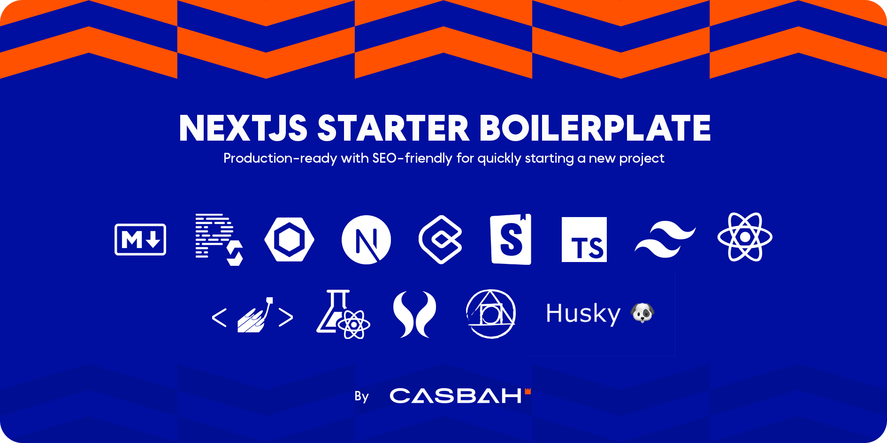

# NextJs-13 Starter Boilerplate
<h1 align="center">
  <a></a>
  <br>
</h1>

🚀🎉📚 Boilerplate and Starter for Next.js 13+ with App Router and Page Router support, Tailwind CSS 3.3 and TypeScript ⚡️ Made with developer experience first: Next.js + TypeScript + ESLint + Storybook + PostCSS + Tailwind CSS + ContentLayer + i18next

## Getting Started

Start your project with this template.

```bash
yarn create next-app -e https://github.com/casbah-ma/NextJs-13-Boilerplate
```

### How to run

`npm install && npm dev`
<br />
`yarn && yarn dev`

### How to build

`npm run build`
<br />
`yarn build`

### How to tests

`npm test`
<br />
`yarn test`

# File structure

**This is your source code tree:**

```
src
|-- app
    |-- api
        |-- hello
            |-- route.ts
        |-- [locale]  
            |-- posts
                |-- [slug]
                    |-- page.tsx
            |-- layout.tsx
            |-- page.tsx
|-- components
|-- configs
|-- helpers
|-- hooks
|-- lib
    |-- registry
|-- styles
    |-- global.css
    |-- GlobalStyles.tsx

...
```

**This is your component structure:**

```
...
components
|-- YourComponent
    |-- YourComponent.stories.tsx
    |-- YourComponent.styles.ts
    |-- YourComponent.types.ts
    |-- index.tsx
...
```

**This is your Markdown Files structure:**

```
...
Data
|-- posts
    |-- post-01.md
...
```

**This is your tests structure:**

```
...
__tests__
|-- components
    |-- YourComponent.test.tsx
|-- pages
    |-- YourPage.test.tsx
...
```

**These are the folders and their functions:**

`./components`

Components are presentational only elements, grouping UI items

`./configs`

Configs are our application's global settings files

`./hooks`

Hooks are functions that allow you to “plug in” to React's state and lifecycle features from functional components

`./app`

App is a new pages folder are mapped in routes and have all the containers needed to implement a functionality


### More utils commands

Find and fix JavaScript and TypeScript problems according to pre-defined rules
`npm run lint`
`yarn lint`

# Advantages of using this react project template

The project is already configured with:

- React
- Typescript
- Jest
- Eslint
- Prettier
- Styled-component
- Husky
- Storybook
- ContentLayer
- TailwindCss
- Twin.macro
- Next-intl


### Main dependecies

- [nextjs](https://nextjs.org/blog/next-13/)
- [react](https://reactjs.org/)
- [styled-components](https://styled-components.com/)
- [contentlayer](https://contentlayer.dev/)
- [tailwindcss](https://tailwindcss.com/)
- [twin.macro](https://github.com/ben-rogerson/twin.macro)
- [next-intl](https://next-intl-docs.vercel.app/)

### Main dev dependecies

- [jest](https://jestjs.io/)
- [testing-library](https://testing-library.com/)
- [eslint](https://eslint.org/)
- [husky](https://www.npmjs.com/package/husky)
- [prettier](https://prettier.io/)
- [typescript](https://www.typescriptlang.org/)
